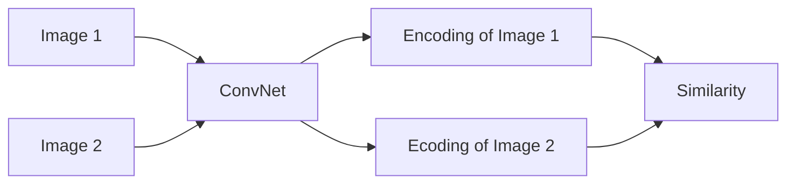
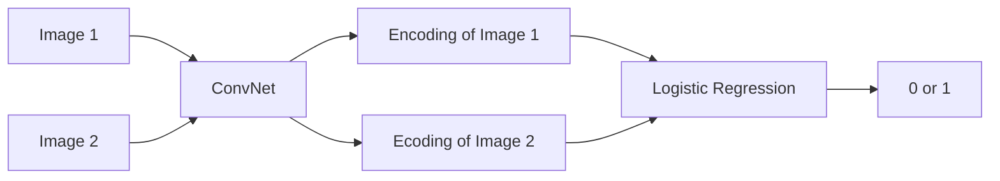

# Face Recognition

- face verification: is this the claimed person? 1 on 1
- face recognition: who is this person? 1 on K

For face recognition, the traditional supervised learning approach won't work well:
- the number of classes is too large, and the number of training examples per class is too small.
- for application, such as company security, the number of classes is not fixed as new employees join the company. We cannot retrain the model every time a new employee joins the company.
  
## One Shot Learning

- one shot learning: one training example of each person
  - typical supervised learning: 100s of examples of each person
- learn a "similarity" function: d(img1, img2) = degree of difference between images 

## Siamese Network

- Siamese Network: a neural network that takes two inputs and outputs a similarity score
  - run two identical neural networks that share the same parameters and weights for two different inputs
  - parameters of NN define an encoding of the input image
  - learn parameters so that the squared distance between the encodings is related to the probability of the two images being the same person. i.e, similar images have similar encodings and thus smaller distance.
  
- Architecture:
    - ConvNet (convolutional layers, pooling layers, fully connected layers)
    - Encoding (feature vector of the image, e.g., a 128 dimensional vector)
    - Similarity

- Training
  - triplet loss: anchor, positive, negative
    - data set: A, P, N
      - anchor (A): image of a person
      - positive (P): image of the same person
      - negative (N): image of a different person
    - require: $d(A, P) \le d(A, N)$
      - $d(A,P) - d(A,N) \le 0$
      - however, this is not a good loss function because it is too easy to satisfy
        - if the encoding is a zero vector, then this loss function is always satisfied
      - need add a margin parameter $\alpha$
        - $d(A,P) - d(A,N) + \alpha \le 0$
        - push the positive pair closer together and push the negative pair further apart
    - loss function:
      - $L(A,P,N) = max(d(A,P) - d(A,N) + \alpha, 0)$
      - summation over all triplets in the training set
  - training set
    - 10k pictures of 1k people (more than 1 picture per person)
    - generate triplets
      - if A, N, P are chosen randomly, then $d(A,P) - d(A,N) + \alpha \le 0$ is easy to satisfy
      - therefore, need choose triplets that are hard to train on, i.e., d(A,P) and d(A,N) are close to each other so that the optimizer can learn parameters to make them deviate from each other
      - the selection of triplets is important for training, and it is time-consuming in this context
  - testing set
    - 1 picture of each person

## Face Verification and Binary Classification
The above Siamese Network can be used for face verification, i.e., given two images, determine whether they are the same person or not. The output of the Siamese Network is a similarity score, and we can set a threshold to determine whether the two images are the same person or not. This is a binary classification problem.

We do this by adding a logistic regression layer on top of the Siamese Network. The logistic regression layer takes the output of the Siamese Network as input and outputs a probability of the two images being the same person. The logistic regression layer is trained on the training set of the Siamese Network.

