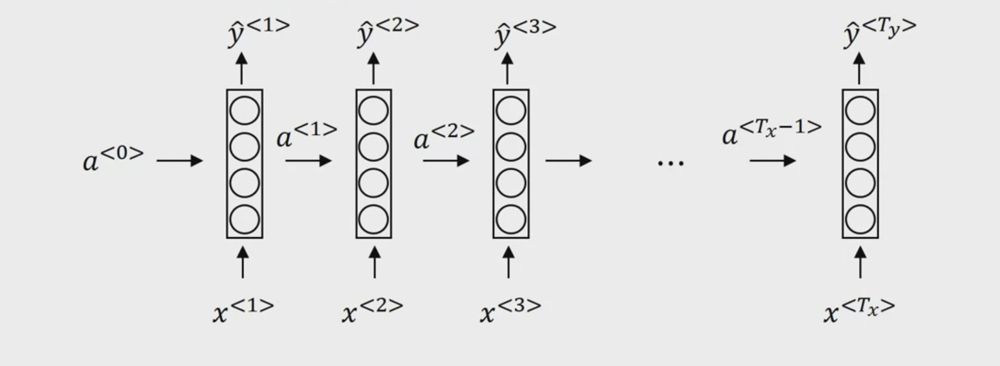

# Recurrent Neural Networks

why not a standard network?

Problems:
- inputs, outputs can be different lengths in different examples
- doesn't share features learned across different positions of text

RNNs are a type of neural network that allow us to operate over sequences of vectors $x^{<1>}, ..., x^{<T_x>}$. 

structure:

- $a^{<0>} = 0$
- layer 1:
  - $a^{<1>} = g(W_{aa}a^{<0>} + W_{ax}x^{<1>} + b_a)$ $\rightarrow$ $g()$ can be `tanh` or `relu` 
  - $\hat y^{<1>} = g'(W_{ya}a^{<1>} + b_y)$ $\rightarrow$ $g'()$ can be `sigmoid` or `softmax`
- layer t:
  - $a^{<t>} = g(W_{aa}a^{<t-1>} + W_{ax}x^{<t>} + b_a)$
  - $\hat y^{<t>} = g'(W_{ya}a^{<t>} + b_y)$

We can rearrange the matrix multiplication to make it more clear:

- $a^{<t>} = g(W_{a}[a^{<t-1>}, x^{<t>}] + b_a)$
- $\hat y^{<t>} = g'(W_{y}a^{<t>} + b_y)$

where $W_{a}$ is a matrix that concatenates $W_{aa}$ and $W_{ax}$. The shape of $W_{a}$ is $(n_a, n_a + n_x)$, where $n_a$ is the number of hidden units and $n_x$ is the number of input units.
$W_y$ is the same as $W_{ya}$, and its shape is $(n_y, n_a)$.

## Backpropagation through time

## RNN types

- Many to many
  - e.g., machine translation
  - e.g., encoder-decoder model
- Many to one
  - e.g., sentiment classification, where the input is a sequence of words and the output is a sentiment label such as 0 or 1 meaning dislike or like
- One to one
  - similar to a standard neural network
- One to many
  - e.g., music generation, where the input is a genre and the output is a sequence of notes

here is a schematic drawings of different types:

## Language model and sequence generation

- training a language model: given a sentence, predict the probability of the next word.

- sample sentence: given a language model (the probability of a sentence), we can generate a sentence by sampling words from the probability distribution.

## Vanishing gradients with RNNs

exploding gradients:
- gradients over iterations get larger and larger: NANs
- parameter updates might be difficult to converge
- solutions:
  - gradient clipping

Vanishing gradients:
- gradients over iterations get smaller and smaller, and eventually become nearly 0, and training stalls
- difficult to solve:
  - for RNN, we need design special architectures to solve this problem

## Gated Recurrent Unit (GRU)
Modification of RNN to solve vanishing gradients problem

Memory cell $C$:
- $C^{<t>}$ is the memory cell at time step $t$, (simply replace $a^{<t>}$ in RNN with $C^{<t>}$)

For a GRU cell, we have:
- $C^{<t-1>} = a^{<t-1>}$
- The candidate memory cell: $\tilde C^{<t>} = tanh(W_c[C^{<t-1>}, x^{<t>}] + b_c)$
- The gate update: $\Gamma_u = \sigma(W_u[C^{<t-1>}, x^{<t>}] + b_u)$. Using `sigmoid` to mimic the behavior of a gate.
- $C^{<t>} = \Gamma_u * \tilde C^{<t>} + (1 - \Gamma_u) * C^{<t-1>}$

**Thoughts**
- aren't these sounding like ResNet, where a skip connection is added to the output of the next layers? 
  - yes. 
  - skip connection can help address the gradient vanishing problem for deep networks
  - however, the more credits of resnet is with skip connection, it is easier to learn an identity function.

Full GRU architecture:

- $c^{<t-1>} = a^{<t-1>}$
- The candidate memory cell: $\tilde c^{<t>} = tanh(W_c[\Gamma_rc^{<t-1>}, x^{<t>}] + b_c)$
- The gate update: $\Gamma_u = \sigma(W_u[c^{<t-1>}, x^{<t>}] + b_u)$. Using `sigmoid` to mimic the behavior of a gate.
- The gate relevance: $\Gamma_r = \sigma(W_r[c^{<t-1>}, x^{<t>}] + b_r)$. how relevant between $c^{<t-1>}$ and $\tilde c^t$
- $C^{<t>} = \Gamma_u \tilde c^{<t>} + (1 - \Gamma_u) c^{<t-1>}$
- $a^{<t>} = c^{<t>}$

## LSTM

More powerful than GRU, but more expensive to train.

- candidate memory cell: $\tilde c^{<t>} = tanh(W_c[a^{<t-1>}, x^{<t>}] + b_c)$
- update gate: $\Gamma_u = \sigma(W_u[a^{<t-1>}, x^{<t>}] + b_u)$
- forget gate: $\Gamma_f = \sigma(W_f[a^{<t-1>}, x^{<t>}] + b_f)$, this is to replace $1 - \Gamma_u$ in GRU
- output gate: $\Gamma_o = \sigma(W_o[a^{<t-1>}, x^{<t>}] + b_o)$
- $c^{<t>} = \Gamma_u \tilde c^{<t>} + \Gamma_f c^{<t-1>}$
- $a^{<t>} = \Gamma_o tanh(c^{<t>})$

Variants:
- `peephole` connection: add $c^{<t-1>}$ to the all the gates before applying `sigmoid`

## Bidirectional RNN

add a backward RNN to the forward RNN, and concatenate the output of the two RNNs.

disadvantages:
- need the entire sequence before making a prediction. For example, in speech recognition, we need to wait until the end of the sentence to make a prediction.
