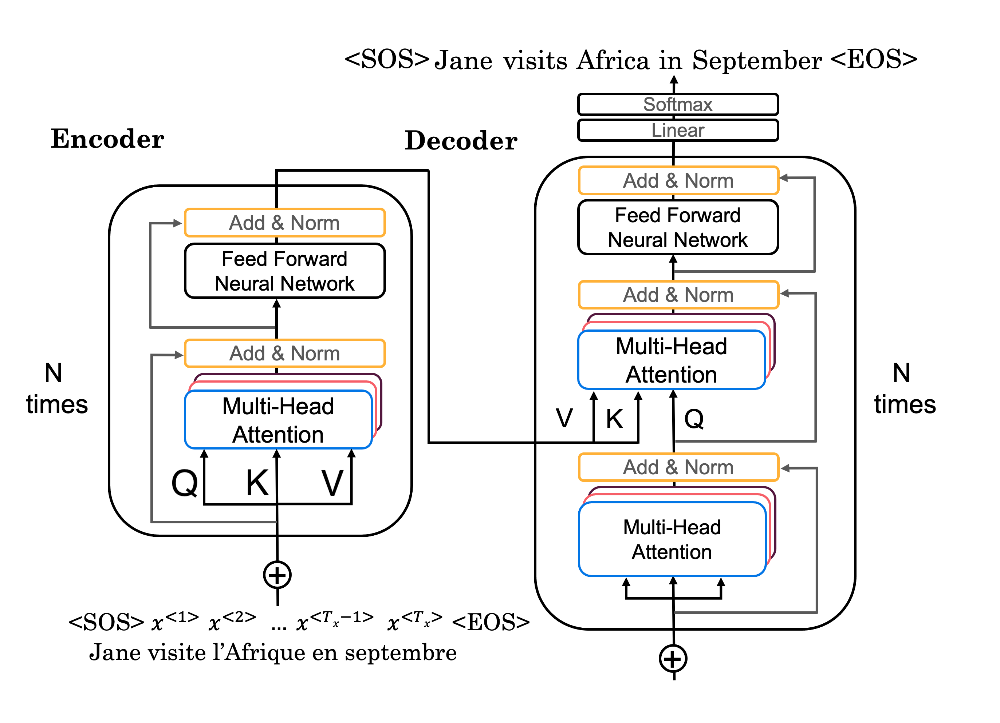

# Transformers

## 1 Motivation

Problems with RNNs:
- RNN: graident vanishing problem
  - can we add residual connections to RNNs?
- GRU:
- LSTM: 

Each unit in the sequence to sequence model is a bottleneck, and the information flow is sequential.
The transformer model allows parallel computation of the sequence, and the information flow is not sequential.

Attention + CNN = Transformer

The structure for the original transformer is:

## 2 Attention

**Note: this analysis follows the `row-vector` convention as in Python**

At top-level, transformer relies on the so-called multi-head attention mechanism. 
The multi-head attention mechanism is a combination of several attention mechanisms, each of which is called a head.

The input and output shape of the multi-head attention is summarized as follows:
- input: $Q, K, V$
  - $Q \in \mathbb{R}^{n_x \times n_e}$
  - $K \in \mathbb{R}^{n_x \times n_e}$
  - $V \in \mathbb{R}^{n_x \times n_e}$
  - where $n_x$ is the input sequence length, and $n_e$ is the embedding dimension
- output: $H$
  - $H \in \mathbb{R}^{n_x \times n_y}$
    - $n_y$ is the output dimension, and it could be any value
    - but because the transformer uses residual connections, $n_y = n_e$

Now let's see more details in depth.

### 2.1 Self-attention
One head is actually a self-attention mechanism, which is a special case of the attention mechanism.

Self-attention is designed to replace RNNs in the encoder part of the sequence to sequence model.
- CNN scheme
- the output sequence is outputted at the same time, instead of sequentially in RNNs
- why not directly use CNN
  - CNNs are not good at capturing long-term dependencies because of fixed size receptive field
  - To capture long-term dependencies, we need to stack many layers of CNNs, which is computationally expensive

**Let's analyze the shape of inputs and outputs**

structure:
- inputs: $Q, K, V$
  - $q^{<t>}$ $\rightarrow$ shape: $(1, n_q)$
  - $k^{<t>}$ $\rightarrow$ shape: $(1, n_k)$
  - $v^{<t>}$ $\rightarrow$ shape: $(1, n_v)$
  - $Q = \begin{bmatrix} q^{<1>} \\ q^{<2>} \\ \cdot \\ q^{<n_x>} \end{bmatrix}$ $\rightarrow$ shape: $(n_x, n_q)$
  - $K = \begin{bmatrix} k^{<1>} \\ k^{<2>} \\ \cdot \\ k^{<n_x>} \end{bmatrix}$ $\rightarrow$ shape: $(n_x, n_k)$
  - $V = \begin{bmatrix} v^{<1>} \\ v^{<2>} \\ \cdot \\ v^{<n_x>} \end{bmatrix}$ $\rightarrow$ shape: $(n_x, n_v)$
  - in original paper, $Q = K = V = X_e$ before entering the multi-head attention, where X_e is the embedding of the input sequence, which has a shape of $(b, n_x, n_e)$. Therefore, it is common to think the above $n_q = n_k = n_v = n_e$. 
  - To void later confusion, we use $n_e$ for the above part, and use $n_q, n_k, n_v$ in the following part where the $Q,K,V$ are linearly transformed into different shapes using trainable parameters.

- linear transformation
  - $Q' = QW^Q$ 
    - $Q \rightarrow (b,  n_x, n_e)$
    - $W^Q \rightarrow (n_e, n_q')$
    - $Q' \rightarrow (b, n_x,n_q')$ 
  - $K' = KW^K$
    - $K \rightarrow (b,  n_x, n_e)$
    - $W^K \rightarrow (n_e, n_k')$
    - $K' \rightarrow (b, n_x,n_k')$ 
  - $V' = VW^V$
    - $V \rightarrow (b, n_x, n_e)$
    - $W^V \rightarrow (n_e, n_v')$
    - $V' \rightarrow (b, n_x,n_v')$ 

- scaled dot-product attention
  - attention of $Q'$ to $K'$: for each query $q'^{<t>}$, calculate the attention score $\alpha^{<t>}$ to all keys $k'^{<1>}$, $k'^{<2>}$, $k'^{<n_x>}$
    - $\alpha^{<t, i>}$, the attention score, known a scaled dot-product attention for query $q'^{<t>}$ and key $k'^{<i>}$
    - $\alpha^{<t, i>} = \frac{q^{<t>} \cdot k^{<i>}}{\sqrt n_{k'}}$, where $n_{k'}$ is the dimension of the query and key, because to make it a dot product, the dimension of the query and key must be the same
    - $\alpha^{<t>} = [\alpha^{<t, 1>}, \alpha^{<t, 2>}, \cdots, \alpha^{<t, n_x>}]$ $\rightarrow$ shape: $(1, n_x)$
  - the matrix $\alpha$ is then writtent as follows:
    - $\alpha = \begin{bmatrix} \alpha^{<1>} \\ \alpha^{<2>} \\ \cdots \\ \alpha^{<n_x>} \end{bmatrix} = \begin{bmatrix} \alpha^{<1, 1>} & \alpha^{<1, 2>} & \cdots & \alpha^{<1, n_x>} \\ \vdots & \vdots & \vdots & \vdots \\ \alpha^{<n_x, 1>} & \alpha^{<n_x, 2>} & \cdots & \alpha^{<n_x, n_x>} \end{bmatrix}$
    - $\alpha = QK^T$ $\rightarrow$ shape: $(b, n_x, n_x)$
      - **this requres $n_{q'} = n_{k'}$**
  
- softmax to get the attention weights
  - for each query $q^{<t>}$, calculate the attention weights to all keys
    - $\alpha^{<t,i>} = \frac{exp(\alpha^{<t, i>})}{\sum_{j=1}^{n_x} exp(\alpha^{<t, j>})}$, for $i = 1, 2, \cdots, n_x$
    - The purpose is to make the sum of attention weights $\alpha^{<t>}$ to be 1, so that the output is a weighted sum of the values
    - softmax does not change the shape, therefore, the output is still $(b, n_x, n_x)$

- calculate the output
  - for each query, calculate the attention-weighted sum of the values
    - $h^{<t>} = \sum_{i=1}^{n_x} \alpha^{<t, i>} v^{<i>}$ for $t = 1, 2, \cdots, n_x$
    - the dot-product representation is $h^{<t>} = \alpha^{<t>} V$
      - $h^{<t>} \rightarrow (b, 1, n_v')$
      - $\alpha^{<t>} \rightarrow (b, 1, n_x)$
      - $V \rightarrow (b, n_x, n_v')$
  - $H = \begin{bmatrix} h^{<1>} \\ h^{<2>} \\ \cdots \\ h^{<n_x>}\end{bmatrix} = \begin{bmatrix} \alpha^{<1>} \\ \alpha^{<2>} \\ \cdots \\ \alpha^{<t'>}\end{bmatrix} \cdot \begin{bmatrix}v^{<1>} \\ v^{<2>} \\ \cdots \\ v^{<n_x>} \end{bmatrix} = \alpha V$ 
    - $\alpha \rightarrow (b, n_x, n_x)$
    - $V \rightarrow (b, n_x, n_v')$
    - $H \rightarrow (b, n_x, n_v')$
  - therefore $n_v' = n_y$, we can specify $n_v'$ for the matrix $V$ to control the output shape of the self-attention layer

## Multi-head attention
a head: each time we calculate self-attention for a sequence is called a head

multi-head attention: calculate self-attention multiple times, and concatenate the results
- $H$ is the concatenation of the results of multiple heads, $\rightarrow$ shape: $(b, n_x, h*n_v')$ 
- The output shape $(b, n_x, h*n_v')$ now may be different from the input $(b, n_x, n_e)$.
- Therefore, to enable the skip addition, the final output for multi-head attention is 
  - $H' = HW^o$
    - $H \rightarrow (b, n_x, h*n_v')$
    - $W^o \rightarrow (h*n_v', n_e)$
    - $H' \rightarrow (b, n_x, n_e)$
  - In the original paper, the authors use $n_e = h*n_v'$, so that $W^o$ is a square matrix, and the output shape is the same as the input shape.

## Positional encoding
self attention didn't consider the order of the word in the sequence
- original paper: each position has a unique positional vector that is not learned from data
- positional vector $p^{<1>}$ is added to the embedding vector, therefore, must have the same dimension as the embedding vector
  - this addition is similar to appending a one-hot position vector to the input vector $x^{<1>}$
  - without positional encoding: $e^{{i}} = Wx^{<i>}$ 
  - with positional encoding: $e^{{i}} = Wx^{<i>} + p^{<i>}$
  - with one-hot positional encoding to $x^{<i>}$: $e^{<i>} = W[x^{<i>},o^{<i>}] = Wx^{<i>} + Wo^{<i>} = Wx^{<i>} + p^{<i>}$, where $o^{<i>}$ is the one-hot positional vector

## Transformer

- encoder
  - input sequence 
- decoder

## Reference
- Hungyee Lee, https://speech.ee.ntu.edu.tw/~hylee/ml/2020-spring.php
- https://www.tensorflow.org/text/tutorials/transformer